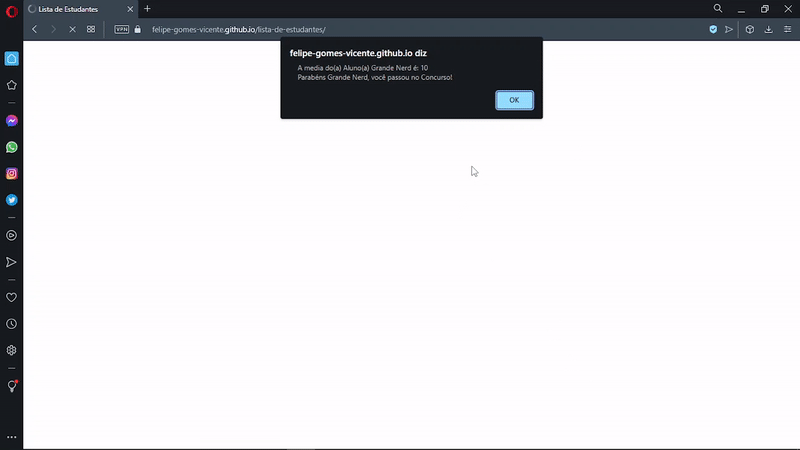

# Lista de Estudantes

<h1 align="center">
    
</h1>

### 💻 Lista de Estudantes

Watch it in action Deploy: [Click Here](https://felipe-gomes-vicente.github.io/lista-de-estudantes/)

What was developed:
In this challenge you will create a list of **students** and each student within 
this list must contain the following data: Name, grade of the first test, second 
test score. Create a **function** that will calculate the average of each student's 
grades, assuming that the average, for this contest is **7**, check **if** each 
student was successful or not in entering the contest and show a message on the 
screen.

- The sum of the two numbers;
- The subtraction of the two numbers;
- The multiplication of the two numbers;
- The division of the two numbers;
- The remainder of the division of the two numbers;
- Data structure with objects;
- Repetition structure;
- Creation of functions;
- Comparative operators;
- Variables;
- Math operations;
- Logic and algorithms in Javascript;

I applied my knowledge of the Explorer from Rocketseat concepts in a practical way 
to this project, with the lessons:
- Introduction to Javacript;

  
<br />

- [EXPLORER - Rocketseat](https://www.rocketseat.com.br/explorer)


## 🧪 Tools

Application developed using the following tools:

- [HTML5](https://www.w3schools.com/html/default.asp)
- [CSS3](https://www.w3schools.com/css/default.asp)

## 🚀 Getting started

Live server with VScode or just clone folder and access index.html

### Programs needed to Getting started

- [Live Server (Opcional)](https://marketplace.visualstudio.com/items?itemName=ritwickdey.LiveServer)
- [Visual Studio Code - Vscode](https://code.visualstudio.com/)

Clone the project and access the folder.

```bash
$ git clone https://github.com/lista-de-estudantes.git
$ cd lista-de-estudantes
```

## 📝 License

This project is under the MIT license. See the file [LICENSE](LICENSE.md) for more details.

---

&nbsp;

<p align="center">Done with 💜 by Felipe Vicente👋</p>

- ## My LinkedIn - [](https://www.linkedin.com/in/felipe-gomes-vicente/)
